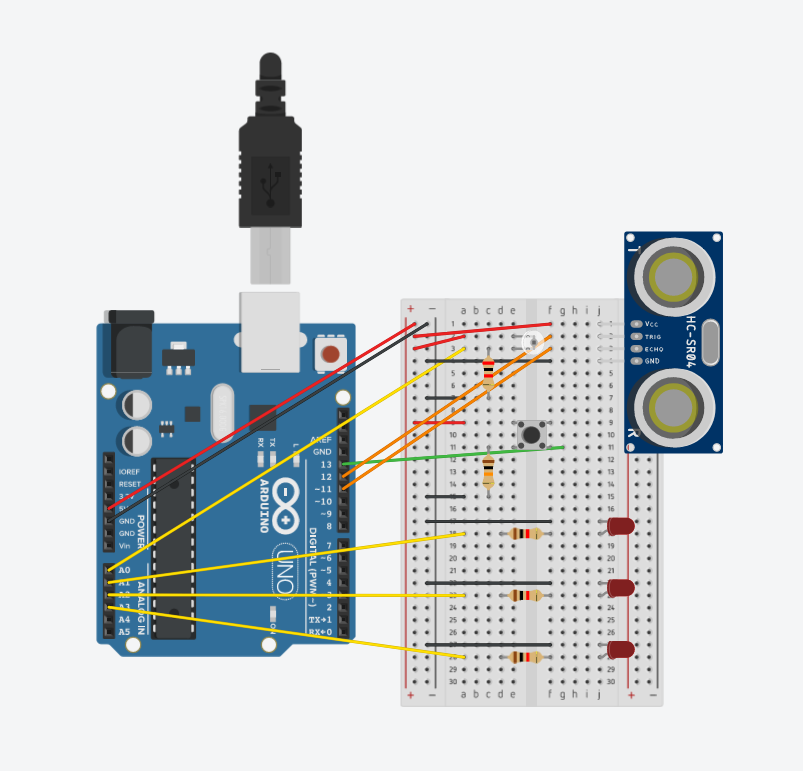

# Ecolumina Arduino
Ecolumina Arduino is a **sensor-based system for efficient public park lighting management**, designed to work alongside a **web-based platform** ([Ecolumina Web](https://github.com/cacobaco/ecolumina-web)). This project was created as part of the **Ubiquitous Systems and IoT** course during the **2023/2024 academic year**, in the third and final year of the **Bachelor's Degree in Computer Engineering**.

## Installation
To set up the system:
1. Upload the provided **Arduino code** to an Arduino board.
2. Connect the required sensors (light and motion sensors) according to the provided circuit diagram.
3. Ensure communication with the **Ecolumina Web** platform for data visualization.

## Team
- **Leonardo Fernandes** (me)
- **Bruno Aguiar**
- **João Jardim**
